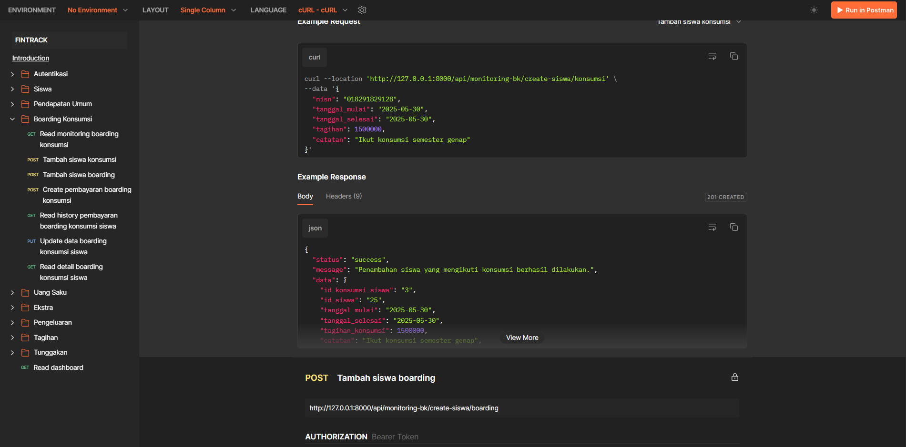
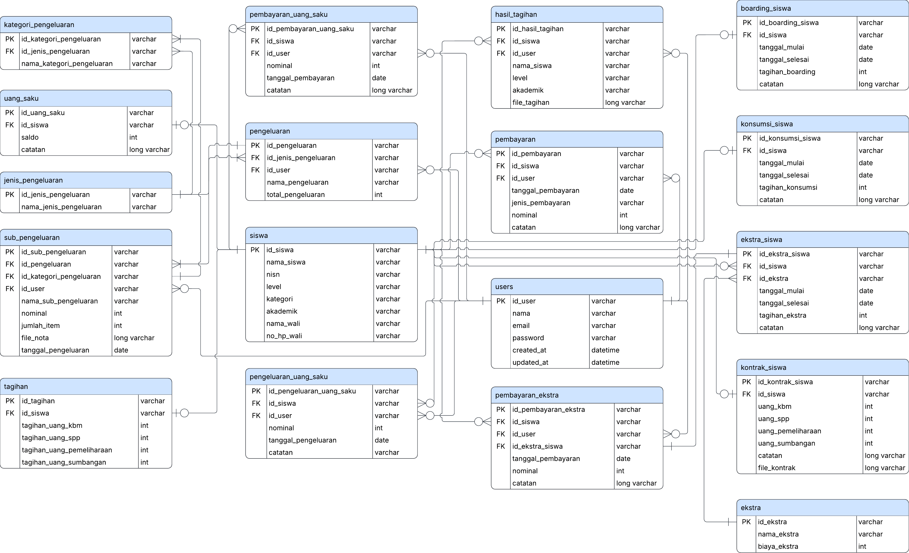
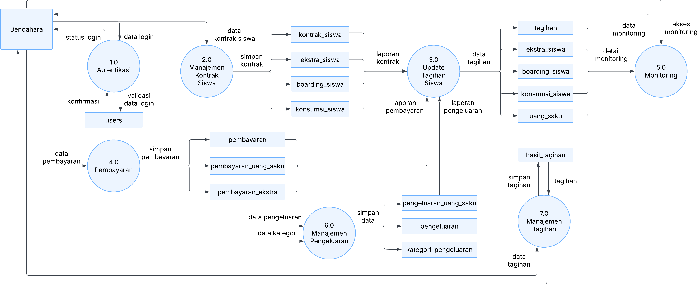
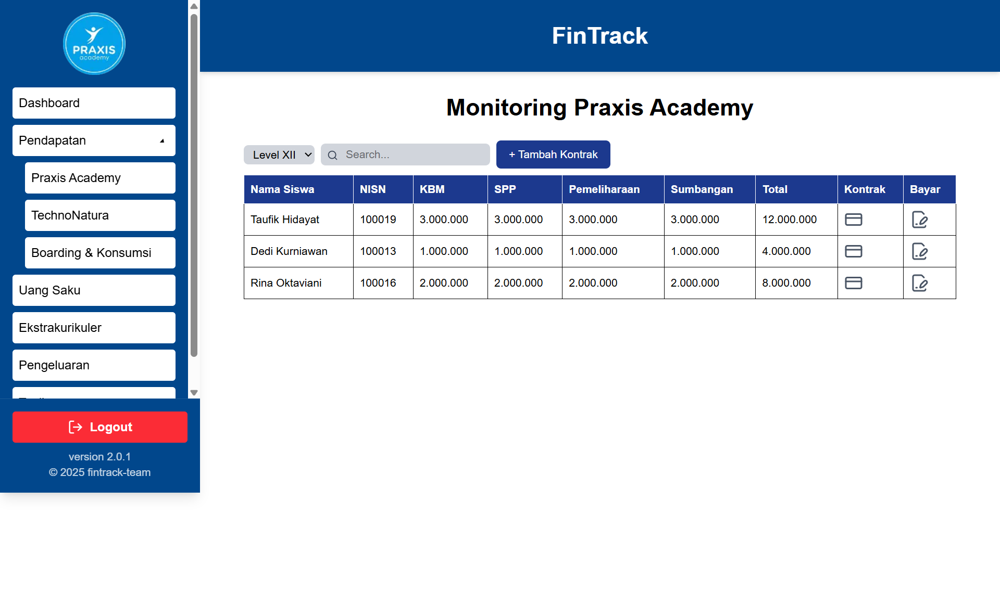
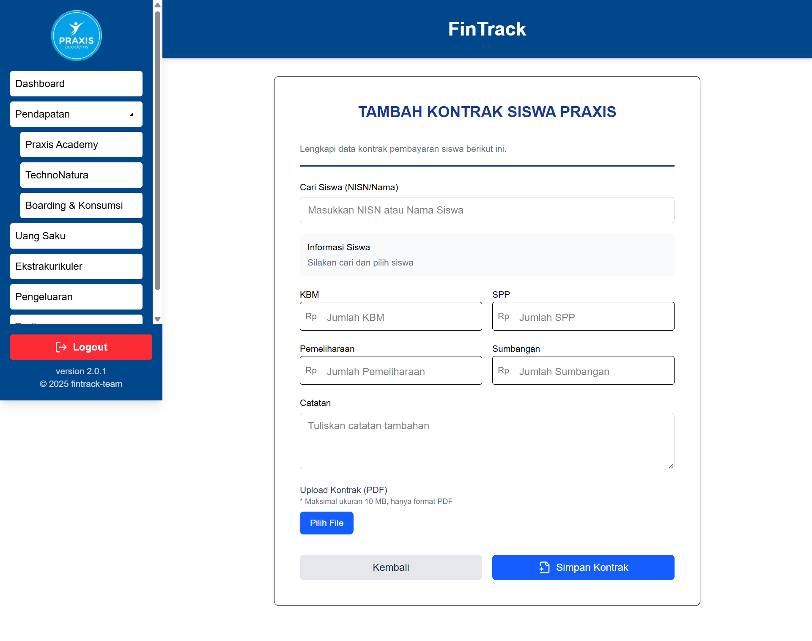

# Finance Tracking (FinTrack) Backend API

## Project Description

FinTrack is a financial management system designed for educational institutions to track student payments, bills, expenses, and various activities. The system manages two student programs (Praxis and Techno) and provides comprehensive financial tracking including general payments, boarding and consumption fees, pocket money, extracurricular activities, and institutional expenses.

API Documentation: https://documenter.getpostman.com/view/37959814/2sB2qfBzgk


ERD & DFD Design Document: https://docs.google.com/document/d/1BdQviPdlNFQlQsyfv5RvU8HGgpr12RaaCdCZ31yqjZU/edit?usp=sharing

*Entity Relation Diagram Design*


*Data Flow Diagram Level 1 Design*

## Frontend Interface


*Dashboard showing financial summary for Praxis and Techno programs*


*Monitoring interface for student bills*


*Form for student registration*

## Tech Stack

- **PHP 8.3.14** - Programming language
- **Laravel 10** - Web framework
- **Laravel Sanctum** - API authentication
- **MySQL** - Database
- **Composer** - Dependency management

## Project Structure

```
FiTrack/
├── app/
│   ├── Console/         # Artisan commands
│   ├── Http/
│   │   ├── Controllers/ # API controllers
│   │   ├── Middleware/  # HTTP middleware
│   │   └── Requests/    # Form request validation
│   ├── Models/          # Eloquent models
│   └── Repositories/    # Data access layer
├── config/              # Configuration files
├── database/
│   ├── migrations/      # Database migrations
│   └── seeders/         # Database seeders
├── routes/
│   └── api.php          # API routes
├── .env                 # Environment variables
└── composer.json        # PHP dependencies
```


## Installation

### Prerequisites

- PHP >= 8.2
- Composer
- MySQL

### Setup Instructions

1. Clone the repository

```bash
git clone https://github.com/annisa-ugm/FinTrack.git
cd FinTrack
```

2. Install dependencies

```bash
composer install
```

3. Configure environment variables

```bash
cp .env.example .env
```

Edit the `.env` file and set your database credentials and other configurations.

4. Generate application key

```bash
php artisan key:generate
```

5. Run database migrations and seeders

```bash
php artisan migrate:fresh --seed
```

6. Start the development server

```bash
php artisan serve
```

The server will be available at `http://127.0.0.1:8000`

## Authentication

This API uses Laravel Sanctum for token-based authentication. Protected routes require an `Authorization: Bearer {token}` header.

### Login

Authenticate a user and receive an access token.

### Logout

Revoke the current access token.

## Main Features

### Dashboard
Provides financial summary including total balance and bills for both Praxis and Techno programs, extracurricular activities, and pocket money.

### Student Management
Search students and create contracts for enrolled students.

### Payment Monitoring
Track payments for Praxis and Techno programs with detailed contract and payment history.

### Boarding & Consumption
Manage boarding and meal services for students, including payment tracking and student enrollment.

### Pocket Money
Track student pocket money balances, top-ups, and expenses.

### Extracurricular Activities
Manage extracurricular programs, student enrollments, and related payments.

### Expense Management
Track institutional expenses with categories and sub-expenses.

### Bills & Arrears
Manage student bills and track outstanding arrears.

## API Endpoints

All endpoints are prefixed with `/api` and require authentication except for login and registration.

For detailed endpoint documentation including request/response examples, refer to the API documentation link above.

## Database Seeding

The application includes seeders for testing purposes. The default seeder creates:
- Test users
- Sample students
- Contract data
- Payment records
- Extracurricular activities
- Expense categories

## Notes

- All monetary values are stored as integers in the database
- The system supports two academic programs: Praxis and Techno
- Authentication tokens are managed through Laravel Sanctum
- CORS is configured to allow frontend integration
